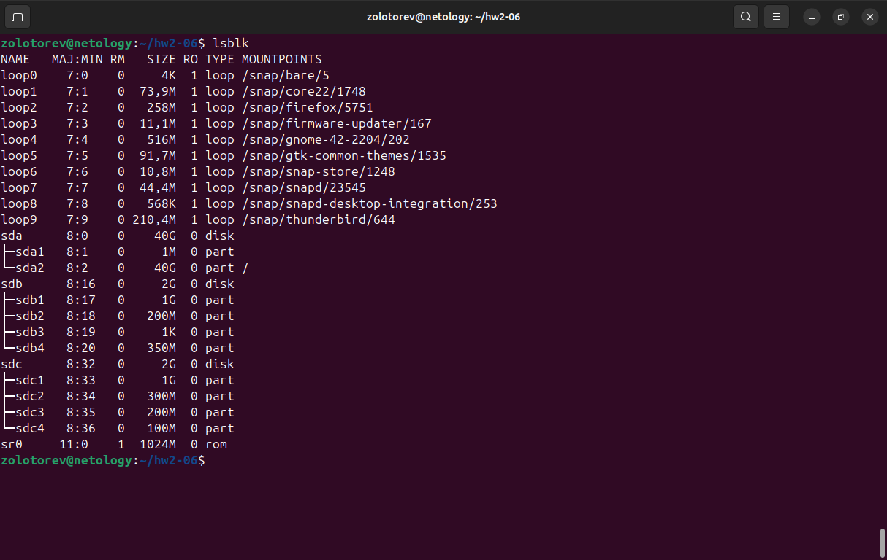
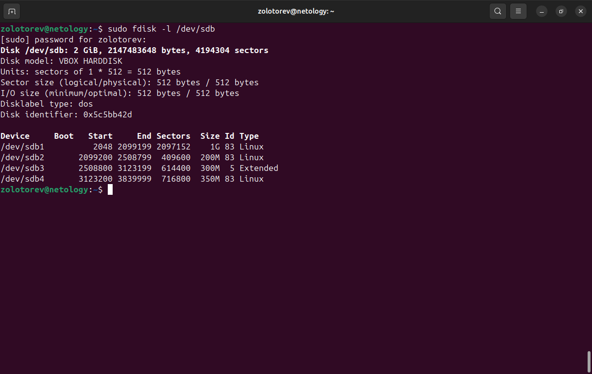
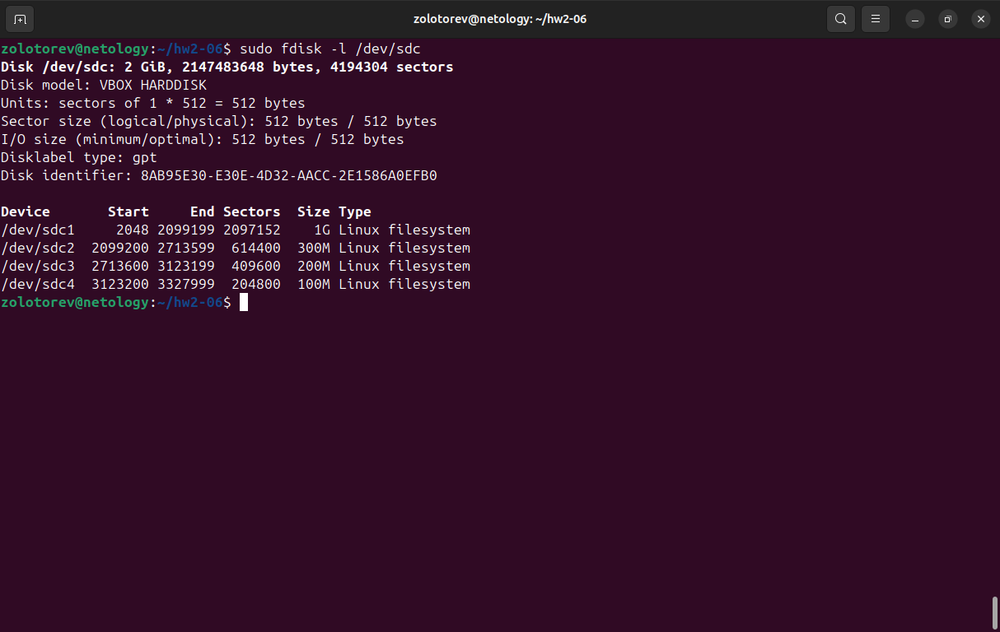

# Домашнее задание к занятию "Дисковые системы"
### Золоторев Н.Д.

### Задание 1
Какие виды RAID увеличивают производительность дисковой системы?

Приведите ответ в свободной форме.

### Решение 1

### Задание 2
Назовите преимущества использования VFS. Используется ли VFS при работе с tmpfs? Почему?

Приведите развернутый ответ в свободной форме.

### Решение 2

### Задание 3

Подключите к виртуальной машине 2 новых диска.

    На первом диске создайте таблицу разделов MBR, создайте 4 раздела: первый раздел на 50% диска, остальные диски любого размера на ваше усмотрение. Хотя бы один из разделов должен быть логическим.

    На втором диске создайте таблицу разделов GPT. Создайте 4 раздела: первый раздел на 50% диска, остальные любого размера на ваше усмотрение.

В качестве ответа приложите скриншоты, на которых будет видно разметку диска (например, командами lsblk -a; fdisk -l)

### Решение 3

