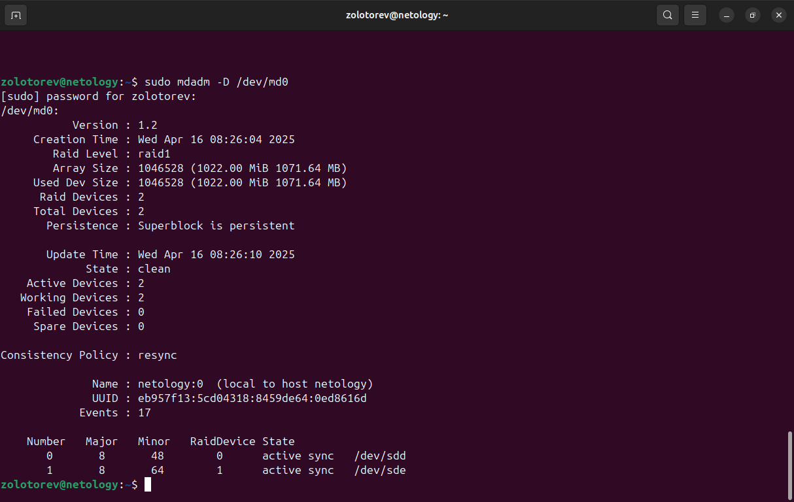

# Домашнее задание к занятию "Дисковые системы"
### Золоторев Н.Д.

### Задание 1

Какие виды RAID увеличивают производительность дисковой системы?

Приведите ответ в свободной форме.

### Решение 1

1. RAID 0.
Данные разделяются на несколько дисков, что увеличивает скорость чтения и записи. При этом отсутствует защита от отказа диска. 1
2. RAID 5.
Этот рейд использует несколько дисков и распределяет данные с контрольной суммой для обеспечения защиты от отказа одного диска. Он предоставляет хорошую скорость чтения и записи, а также некоторую защиту от сбоев дисков. 1
3. RAID 10.
Объединяет характеристики RAID 0 и RAID 1. Данные дублируются и разделены между несколькими дисками, обеспечивая как высокую скорость, так и защиту от сбоев дисков. 1
4. RAID 50. 
Комбинирует несколько наборов RAID 5 в более сложной конфигурации, чтобы обеспечить баланс между скоростью и безопасностью. 
    
### Задание 2
Назовите преимущества использования VFS. Используется ли VFS при работе с tmpfs? Почему?

Приведите развернутый ответ в свободной форме.

### Решение 2
Преимущества:

- Унифицированный доступ к различным файловым системам. 
- Приложения могут работать с файлами и каталогами в разных файловых системах через одинаковый интерфейс. 
- Возможность работать с файлами и директориями, хранящимися на разных носителях и сетевых хранилищах. Будто они находятся на локальном диске. 
- Подключение удалённых сетевых файловых систем. Можно работать с файлами и директориями, расположенными на удалённых серверах через протоколы сетевого доступа.
- Контроль доступа к файлам и директориям. Это происходит с помощью прав доступа и аутентификации пользователя.
- Возможность переиспользовать код. Основные методы, связанные с файловыми системами, не нужно повторно реализовывать для каждого типа файловой системы. 

Используется ли VFS при работе с tmpfs? Почему?

Да, при работе с tmpfs используется виртуальная файловая система (VFS).
VFS предоставляет уровень абстракции для управления всеми файловыми системами в операционной системе Linux, включая tmpfs. С её помощью происходит совместная работа ядра и приложений, установленных в системе. VFS позволяет пользователю работать, не учитывая особенности каждой конкретной файловой системы. VFS управляет метаданными файлов и директорий (например, их атрибутами и структурой), что делает его необходимым для организации временной файловой системы, такой как tmpfs. Tmpfs хранит файлы в оперативной памяти, и VFS обеспечивает необходимые механизмы для управления этим процессом, что помогает избежать необходимости работы с физическим диском, увеличивая скорость операций. Таким образом, VFS играет ключевую роль при работе с tmpfs, обеспечивая удобный и единообразный интерфейс для взаимодействия с временной файловой системой.

### Задание 3

Подключите к виртуальной машине 2 новых диска.

    На первом диске создайте таблицу разделов MBR, создайте 4 раздела: первый раздел на 50% диска, остальные диски любого размера на ваше усмотрение. Хотя бы один из разделов должен быть логическим.

    На втором диске создайте таблицу разделов GPT. Создайте 4 раздела: первый раздел на 50% диска, остальные любого размера на ваше усмотрение.

В качестве ответа приложите скриншоты, на которых будет видно разметку диска (например, командами lsblk -a; fdisk -l)

### Решение 3

### Задание 4

Создайте программный RAID 1 в вашей ОС, используя программу mdadm.

Объем RAID неважен.

В качестве ответа приложите скриншот вывода команды mdadm -D /dev/md0, где md0 - это название вашего рейд массива (может быть любым).

### Решение 4

